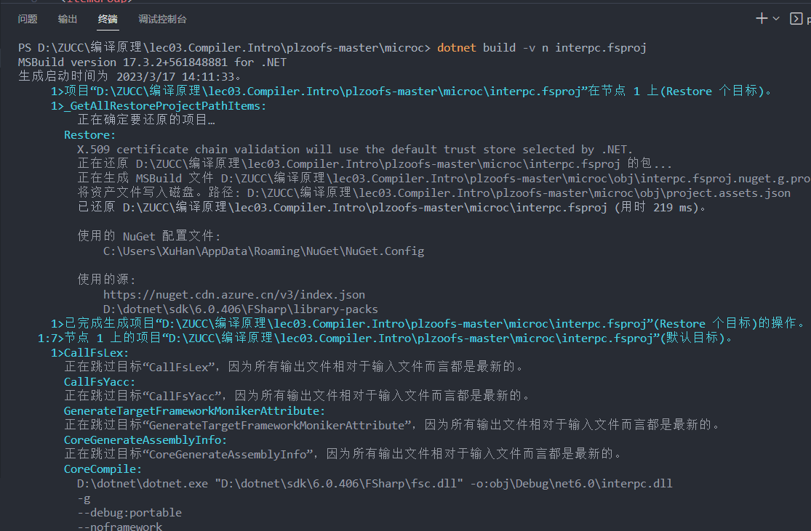

# 2022-23学年第2学期

##  实 验 报 告


-   课程名称: <u>编程语言原理与编译</u>

-   实验项目: <u>MicroC解释器</u>

-   专业班级: <u>计算机0701</u>

-   学生学号: <u>32004151</u>

-   学生姓名: <u>徐韩</u>

-   实验指导教师:<u>郭鸣</u>

## 实验内容

1. 阅读课件 [MicroC实现,解释器 - 编程语言与编译][ch06]

2. 阅读 [计算的本质][plcgroup]第1 2 3章 ,阅读 lecture02.Introduction to Semantics.pdf
    - [计算的本质][plcgroup]

    - 请说明大步语义，小步语义的区别

      大步语义和小步语义在描述程序语义的角度和方式上存在差异。大步语义强调程序整体的执行结果，而小步语义则更关注程序的执行过程和每个步骤的细节。

3. 阅读课件 2.call.by.parameters.pdf

    - 请说明 Call by reference, Call by value的区别

      Call by value传递的是参数值的副本，对参数的修改不会影响原始参数，而Call by reference传递的是参数的引用或地址，允许函数对参数进行修改并对原始参数产生影响。

    - (选做)请说明什么是Call by need 

4. 阅读简单命令式语言代码`imp.zip`(自选)

    - 理解命令式语言**存储模型**

      在命令式语言存储模型中，变量被存储在内存中的特定位置。每个变量都有一个唯一的标识符（通常是变量名），程序可以通过这个标识符来引用和操作变量。变量可以保存不同的数据类型，例如整数、浮点数、布尔值等。

    - 写出函数`setSto` `getSto` 的类型声明

      `setSto :: a -> b -> (a -> b -> c) -> c`

      `getSto :: (a -> b -> c) -> a -> b -> c`

    - 请说明 命令式语言与函数式语言**执行模型**的不同之处

      命令式语言和函数式语言在执行模型上的不同主要体现在状态管理、可变性、副作用、控制流和并发性方面。

5. 阅读`MicroC` 解释器代码

    - 请说明 存储 Store 与 环境 Env 的区别

      存储是保存变量和它们的值的数据结构，而环境是变量和值之间的映射关系。存储通常是可变的，允许修改变量的值，而环境通常是不可变的，支持变量的作用域和访问控制。存储由执行环境或运行时系统管理，而环境由编译器或解释器生成和使用。

    - 请说明 抽象语法树中 对**左值和右值**的表示方式

      在AST中，左值通常以表示存储位置或变量的节点的形式出现，而右值通常以表示表达式的节点的形式出现。左值表示可被赋值的目标，右值表示计算表达式的结果。

    - 请说明 表达式`a[i] + x` **左值求值**和**右值求值**的过程,需要调用解释器的哪些方法

      左值

      解释器首先需要评估表达式 `a[i]` 中的索引 `i` 的值。它会调用解释器的方法来计算 `i` 的值。

      接下来，解释器会通过调用方法来获取数组 `a` 中索引为 `i` 的元素的值。这需要解释器根据 `a` 和 `i` 的值访问相应的存储位置或变量。

      右值

      解释器首先需要评估表达式 `a[i]` 的值。它会按照左值求值的过程来计算 `a[i]`。
      
      然后，解释器需要评估变量 `x` 的值。它会调用相应的方法来获取 `x` 的值。

6. 请写出 `MicroC` 解释器中以下3个函数的类型声明,说明每个参数的含义

    ```fsharp
    eval 函数接受一个表达式 Expr 和一个环境 Env 作为参数，并返回一个值 Value。该函数用于评估（解释执行）给定的表达式，并根据环境中的变量和操作符执行相应的计算。
    
    exec 函数接受一个语句 Stmt 和一个环境 Env 作为参数，并返回一个更新后的环境 Env。该函数用于执行给定的语句，可能会对环境中的变量进行修改或执行其他操作，然后返回更新后的环境。
    
    access 函数接受一个字符串作为变量名，以及一个环境 Env，并返回一个值 Value。该函数用于从环境中获取指定变量名的值，并将其作为结果返回。
    ```

    - 用解释器 运行 `ex9.c` 给出运行结果. 说明递归调用过程.

      

    - gitee.com/sigcc/plzoofs microc目录 完成 `ReadME.md`中的A部分.

      

      

7. 由于c 语言的变量声明时，被声明的标识符居中，左侧右侧都会有语法构造、如  `* []` ，因此变量声明解析是语法分析中的一个难点，

     请 执行 example/declare.c ，查看如下语句的抽象语法表示 ，结合 CPar.fsy 理解对应 yacc 文件写法。 

     - `int a`: `int (TypI, "a")`
     - `int *a`: `pointer to int (TypP (TypI, "a"))`
     - `int a[2]`: `array of 2 ints (TypA (TypI, Some 2), "a")`
     - `int *a[]`: `array of pointers to int (TypA (TypP TypI, None), "a")`
     - `int (*a)[]`: `pointer to array of ints (TypP (TypA (TypI, None)), "a")`
     - `int *(*a)[]`: `array of pointers to int (TypA (TypP TypI, None), "a")`

8. 在ex1.c 中  ,若  有声明 `int h[3]` 长度为3的数组

    - 则代码 赋值 `h[4] = 5`; 会导致数组越界
      - 请解释程序运行的结果
      
        
      
        原本要放进*h[4]*中的5因为数组越界赋值给了n

9. 修改解释器，在运行中提示越界访问错误

    ```F#
    let rec eval (s: stmt) (env: env) (sto: sto) : sto =
        match s with
        | Assign (v, e) ->
            let loc = getLoc v env
            let value = evalExp e env sto
            if isOutOfBounds loc sto then
                failwith "Array index out of bounds"
            else
                updateStore sto loc value
        | ...
    
    and evalExp (e: expr) (env: env) (sto: sto) : value =
        match e with
        | Var v ->
            let loc = getLoc v env
            if isOutOfBounds loc sto then
                failwith "Array index out of bounds"
            else
                readStore sto loc
        | ...
    
    ```

    

10. 预习下章 [micro C stack machine][ch07] 指令系统 重点理解

    ```bash
    LDI 将立即数加载到栈顶。
    STI 将栈顶的值存储到内存地址中。
    GETBP 获取当前帧的基址。
    GETSP 获取当前栈顶指针。
    CALL 函数调用。
    RET 函数返回。
    等指令
    ```

    - 请使用编译器 输出 ex9.c 的指令代码

      

## 实验要求

1. 完成各题目,zip包上传
2. 使用Markdown文件完成
3. 使用[Git](https://learngitbranching.js.org/)工具管理作业代码、文本文件

[ch06]: https://plc2023.pages.dev/#/06/microc.interp
[plcgroup]: http://zucc.courses.zj.edu.cn/user/resource-groups#/78/resources?pageIndex=1
[ch07]: https://plc2023.pages.dev/#/07/microc.compiler
