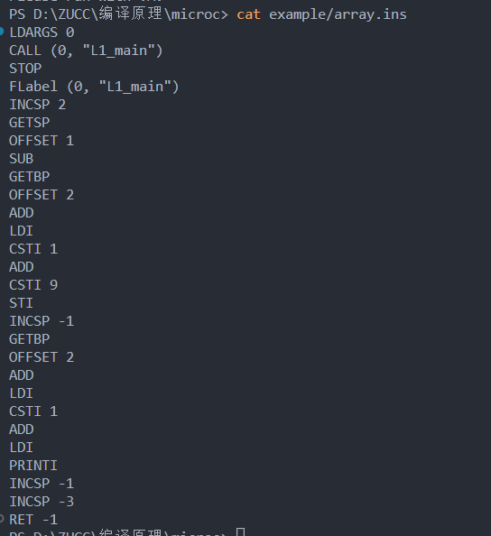

# 2022-23学年第2学期

##  实 验 报 告


-   课程名称: <u>编程语言原理与编译</u>

-   实验项目: <u>MicroC编译器</u>

-   专业班级: <u>计算2004</u>

-   学生学号: <u>32004151</u>

-   学生姓名: <u>徐韩</u>
-   实验指导教师:<u>郭鸣</u>

## 实验内容

### 1.  阅读课件 [MicroC实现,编译器 - 编程语言与编译][ch07]

### 2.  阅读`MicroC` 解释虚拟机指令集

- LDI 

  将 栈帧上 某位置的值入栈

- STI 

  将 值写入栈上某个位置

- GETBP 

  得到当前栈帧基地址

- GETSP 

  得到当前栈帧基地址所存储的值

- CALL 

  CALL m,a call 执行后，将 返回地址`r`

- RET

  `RET m` 与 `CALL m` 对应，从`bp` 开始算，第`m`个值，就是 V~m~

请说明上面指令的作用

### 3.  完成  [MicroC](https://gitee.com/sigcc/plzoofs/tree/master/microc) /ReadME.md 任务`B`

```sh
# 编译microc编译器,并用microc编译器 编译 ex3.c 
~ microc>dotnet clean  microc.fsproj  # optional
~ microc>dotnet build  microc.fsproj  # optional
~ microc>dotnet run --project microc.fsproj example/ex3.c # 编译
Micro-C Stack VM compiler v 1.2.0 of 2021-5-12
Compiling ex3.c ......

VM instructions saved in file:
        ex3.ins
VM instructions saved in file:
        ex3.insx86
x86 assembly saved in file:
        ex3.asm
Numeric code saved in file:
        ex3.out
Please run with VM.
~ microc>cat example/ex3.ins  # Stack VM 汇编指令 ，便于阅读
LDARGS 1
CALL (1, "L1_main")
STOP
FLabel (1, "L1_main")
INCSP 1
GETBP
OFFSET 1
ADD
CSTI 0
...
~ microc>cat example/ex3.out           # ex3.out机器码，数字格式，便于执行
24 19 1 5 25 15 1 13 0 1 1 0 0 12 15 -1 16 43 13 0 1 1 11 22 15 -1 13 0 1 1 13 0 1 1 11 0 1 1 12 15 -1 15 0 13 0 1 1 11 13 0 0 1 11 7 18 18 15 -1 21 0
~ microc> gcc machine.c -o machine # gcc编译器生成虚拟机
                                   # 机房电脑查看devc++的安装路径
                                   # 自己电脑小组资源--》tools # 安装 tdm64-gcc-9.2.0.zip
~ microc>./machine.exe ex3.out 10  # 执行ex3.out机器码
0 1 2 3 4 5 6 7 8 9 Used   0.000 cpu seconds

~ microc>./machine.exe -trace ex3.out 10  # 执行ex3.out机器码 显示调试信息
[ ]{0:LDARGS}
[ 1 ]{1:CALL 1 5}
[ 4 -999 1 ]{5:INCSP 1}
[ 4 -999 1 0 ]{7:GETBP}
[ 4 -999 1 0 2 ]{8:CSTI 1}
[ 4 -999 1 0 2 1 ]{10:ADD}
[ 4 -999 1 0 3 ]{11:CSTI 0}
[ 4 -999 1 0 3 0 ]{13:STI}
[ 4 -999 1 0 0 ]{14:INCSP -1}
[ 4 -999 1 0 ]{16:GOTO 43}
[ 4 -999 1 0 ]{43:GETBP}
[ 4 -999 1 0 2 ]{44:CSTI 1}
[ 4 -999 1 0 2 1 ]{46:ADD}
[ 4 -999 1 0 3 ]{47:LDI}
[ 4 -999 1 0 0 ]{48:GETBP}

~ microc>./machine.exe -trace ex3.out #不带参数程序会如何运行，通过分析调试输入，给出解释？

# C# 版本 虚拟机machine.exe编译 参考 README D部分
注意可能会与microC编译器冲突，先运行 dotnet clean machine.csproj


```


请编译如下MicroC案例程序，读懂相应的 输出代码  `*.ins` ，理解各种编程结构（if while function）的`编译模式`

- example/emptymain.c

  

- example/onearg.c

  

- example/global.c

  

- example/array.c

  

- example/while.c

  

- example/if.c

  

- example/return.c

  

- example/function.c

  

- example/*.c


### 4.  请阅读 `ex9.trace.0.txt` `ex9.trace.3.txt`理解 源代码 和 指令的对应关系

```sh
 ./machine.exe example/ex9.out 0
 ./machine.exe -trace example/ex9.out 3
```
[运行示例参见][ch07] 

此题内容考试中常见。

### 5.  请用 运行下面的命令,仿照4 写出 虚拟机代码的注释

- machine.exe example/ex5.out 5
- machine -trace example/ex5.out 5

### 6. 在ex1.c 中

- 加上代码 h[4] = 5; 
- 结合MicroC堆栈的布局，请解释一下程序运行的结果
- 试试分别加上 h[5]---h[12]，程序发生了什么？
  - 网上搜索缓冲区溢出漏洞的基本原理

### 7. 大作业的编译器改进任务（自选）

#### Exercise 8.3

This abstract syntax for preincrement `++e` and predecrement `--e` was
introduced in Exercise 7.4:

```fsharp
type expr =
...
| PreInc of access (* C/C++/Java/C ++i or ++a[e] *)
| PreDec of access (* C/C++/Java/C --i or --a[e] *)
```

Modify the compiler (`function cExpr`) to generate code for `PreInc(acc)` and
`PreDec(acc)`. To parse micro-C source programs containing these expressions,
you also need to modify the lexer and parser.
It is tempting to expand `++e` to the assignment expression `e = e+1`, but that
would evaluate e twice, which is wrong. Namely, e may itself have a side effect, as
in `++arr[++i]`.
Hence e should be computed only once. For instance, `++i` should compile to
something like this: 

`<code to compute address of i>;, DUP, LDI, CSTI 1, ADD, STI`, 

where the address of `i` is computed once and then duplicated.
Write a program to check that this works. If you are brave, try it on expressions of
the form `++arr[++i]` and check that i and the elements of arr have the correct
values afterwards.

#### Exercise 8.6

Extend the lexer, parser, abstract syntax and compiler to implement\
switch statements such as this one:

```fsharp

switch (month) {
    case 1:
        { days = 31; }
    case 2:
        { days = 28; if (y%4==0) days = 29; }
    case 3:
        { days = 31; }
}
```

Unlike in C, there should be no fall-through from one case to the next: after the

last statement of a case, the code should jump to the end of the switch statement.

The parenthesis after switch must contain an expression. The value after a case

must be an integer constant, and a case must be followed by a statement block.

A switch with n cases can be compiled using n labels, the last of which is at the

very end of the switch. For simplicity, do not implement the break statement or

the default branch.

#### Exercise 8.7

(Would be convenient) Write a disassembler that can display a machine code program in a more readable way. You can write it in Java, using a variant

of the method insname from Machine.java.

#### Exercise 8.9

Extend the language and compiler to accept initialized declarations\
such as

```fsharp
int i = j + 32;
```

Doing this for local variables (inside functions) should not be too hard. For global
ones it requires more changes.

## 实验要求

1. 完成各题目,打包上传
2. 使用Markdown文件完成
3. 使用[Git](https://learngitbranching.js.org/)工具管理作业代码、文本文件

[ch07]: https://plc2023.pages.dev/#/07/microc.compiler
